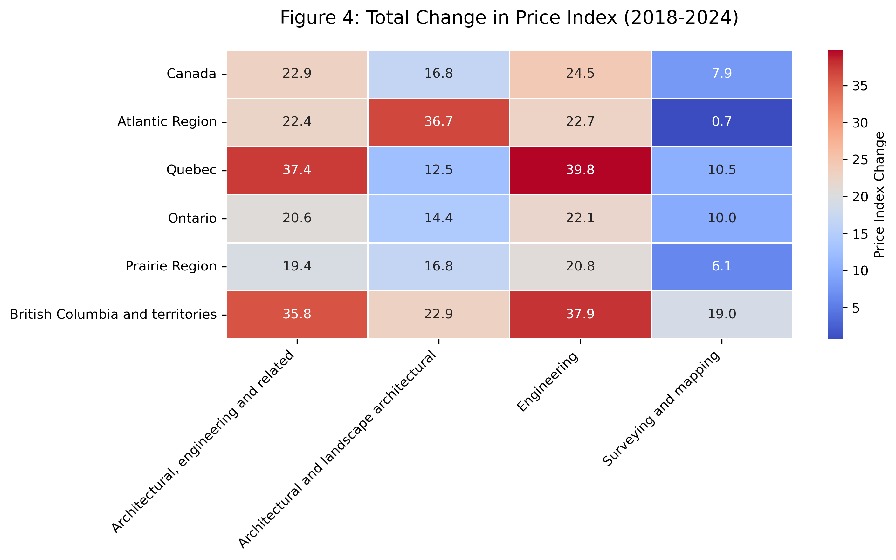

# Canadian Architectural & Engineering Services Price Analysis


## 📌 Project Overview
Analysis of Statistics Canada's **AESPI** dataset tracking professional service prices across Canadian regions (2018-2024). 

**Primary Objective**: Identify regional and sector-specific pricing trends (2018-2024) to help businesses:
- Optimize procurement timing
- Anticipate regional cost pressures
- Benchmark service expenditures

Combines two approaches:
1. **Exploratory data analysis** (Jupyter Notebook)
2. **Interactive dashboard** (Plotly Dash)

---

## 🌐 Live Dashboard

Explore the interactive dashboard here:  
👉 **[canada-service-prices.ca-central.elasticbeanstalk.com](http://canada-service-prices.ca-central.elasticbeanstalk.com)**  
*(Hosted on AWS Elastic Beanstalk)*

This dashboard includes:
- Time series plots by region/service
- Choropleth maps showing regional averages
- Year-over-year percentage change charts

---

## 📜 License
MIT License - see [LICENSE.txt](LICENSE.txt).

## 🏗️ Repository Structure
```
canada-service-prices/
├── analysis/                # Jupyter notebook + static visuals
├── dashboard/               # Interactive app
├── data/                    # Raw and processed datasets
├── environment.yml          # Conda environment specification
├── LICENSE.txt              # MIT License terms
└── README.md
```

## 🔍 Key Insights
1. **Price Index Variations**
   - **Quebec & BC**: Highest increases (+37.4 Quebec, +35.8 BC index points)
   - **Ontario/Prairies**: Most stable growth (+20.6 Ontario, +19.4 Prairie points)

2. **Sector Comparisons**  
     
   *Engineering services drove Quebec's price surge (+39.8 points) and BC's increase (+37.9 points), while surveying services stagnated in Atlantic Canada (+0.7). Architectural services spiked in the Atlantic Region (+36.7 points).*

## 🚀 Getting Started
### 1. Setup Environment
```bash
conda env create -f environment.yml
conda activate aespi-env
```

### 2. Run Analysis
```bash
jupyter notebook analysis/analysis.ipynb
```

### 3. Launch Dashboard
```bash
python dashboard/app.py  # Runs on http://localhost:8050
```

## 🛠️ Technical Stack
- **Data Processing**: Pandas, NumPy
- **Data Cleaning**: missingno
- **Visualization**: Matplotlib, Seaborn
- **Dashboard**: Plotly Dash, GeoPandas
- **Geospatial**: GeoJSON, Choropleth maps

## 📊 Data Source
Statistics Canada. [Table 18-10-0164-01  Architectural, engineering and related services price index, quarterly](https://www150.statcan.gc.ca/t1/tbl1/en/tv.action?pid=1810016401)

---

**Note**: Focuses on observable trends rather than predictive modeling due to rapidly changing economic conditions.
